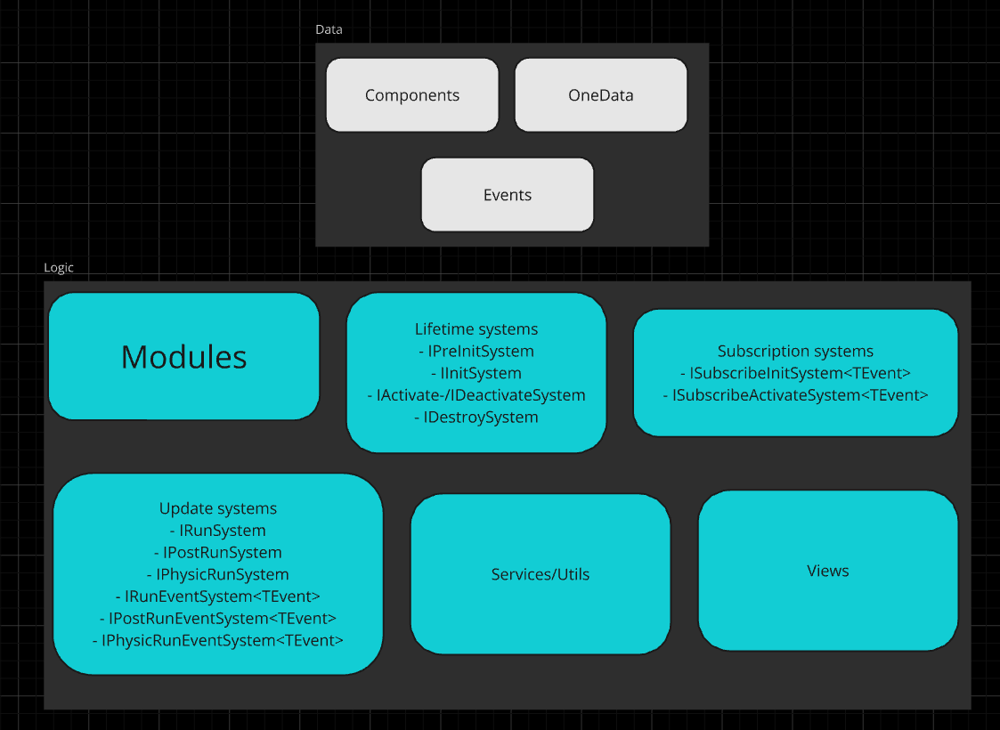

## What is ModulesFramework

**Modules** is a low-level framework that allows you to build your project based on maintanable and transparent types of objects. It allows you to focus on the product instead of wastign your time on code fundament.

## Why ModulesFramework

Every programm in this world works with a data. It tooks the data from one place and put it in another form into another place. The more easily you can work with your data the more fast and effectively you will create your product.

ModulesFramework uses data-driven approach with ECS support with focus on modularity and simplicity of creating and changing your project. It gives you small kit of abstraction that's enough to create anything you want. You can create very complex project while saving maintainability of it. You can reuse modules between projects withou modifying them. You can create your own architecture sustainable exactly for your project without being limited by framework. You can start with simple simple components and systems and then refactor them without changing architecture, i.e. you can create prototype without throwing them later in a trash.

### N.B.

MF is not a pure ECS framework! Instead it has ECS pattern as part and allows you to develop whole project 
basing only at one collection of abstractions. In another words it gives you homogeneous architecture 
instead of mix some classic architecture pattern and ECS.

- [Queries](#gs-queries)
- [Events](#gs-events)
- [Indices](#gs-indices)
- [Entity's Custom Id](#gs-entities-customid)
- [Submodules](#gs-submodules)
- [Dependency Injection](#gs-di)
- [Multiple Components](#gs-multiple)
- [Multiple Worlds](#gs-multiple-worlds)
#### FAQ
- [How to create an instance of system?](#faq-1)
- [What is a module?](#faq-2)
- [How to get entities with three components?](#faq-3)
- [How to get entities without some component?](#faq-4)
- [How to get entities with hp > 0 but < 100?](#faq-5)
- [How to create OneData?](#faq-6)
- [How to get OneData?](#faq-7)
- [How to get entities with one of the several components?](#faq-8)
#### [Best practices](#best)
#### [API](#api-0)
#### [Projects](#projects-0)


## <a id="getting-started"/> Getting started

This is all abstraction that you need to create anything you want with MF.



And all you need to start using ModulesFramework
is this short code:

```csharp
public void MyEntryPoint() 
{
    var ecs = new MF();
    ecs.Start();
}
```

Next steps depend on what you want to do. 
Here's an example for game server:

```csharp
public class MyServer
{
    private MF _ecs;
    
    public MyServer()
    {
        _ecs = new MF();
    }
    
    public void StartServer()
    {
        _ecs.Start();
    }
    
    public void Tick()
    {
        _ecs.Run();
        _ecs.PostRun();
    }
    
    public void StopServer()
    {
        _ecs.Destroy();
    }
}
```

##### Battle example

Let's create some battle feature. We want to create one
player and three enemies. Then we want to make some damage.
Finally, we want to destroy entities when they hp <= 0.

First, we need a global module that starts up our simple example.

**Note:** you shouldn't bind all logic to a global module,
because the battle (or any other feature) may - and will - be part of a complex game.

So let's create global module:

```csharp
[GlobalModule]
public class StartupModule : EcsModule
{
    protected override Task Setup()
    {
        return Task.CompletedTask;
    }
}
```
And create our battle module:

```csharp
public class BattleModule : EcsModule
{
}
```

Now we are just init and activate battle module from startup.
**Note**: for fast prototype you can make battle module global. 

```csharp
[GlobalModule]
public class StartupModule : EcsModule
{
    protected async override Task Setup()
    {
        await world.InitModuleAsync<BattleModule>(true);
    }
}
```

Now let's create some components.

```csharp
public struct Hp
{
    public int current;
    public int max; // just for example
}

public struct Damage
{
    public int damageValue;
}

public struct PlayerTag {}
public struct EnemyTag {}
public struct DeadTag {}
```
As you see, all components are a struct. It reduces heap usage and increases performance.

Now we are ready to create our systems. 
Let's start from creating players and enemies.

```csharp
[EcsSystem(typeof(BattleModule))] // bind system to module
public class InitBattleSystem : IInitSystem
{
    // the DataWorld give access to all data and modules
    // it injects automatically into any system
    private DataWorld _world;
    
    // init calls after module setup is done and all IPreInitSystem
    public void Init()
    {
        // creates and return new entity
        _world.NewEntity()
            // entity provides fluent api to work with
            .AddComponent(new PlayerTag())
            .AddComponent(new Hp() { 
                maxValue = 100, 
                current = 100 
            });
            
        for (var i = 0; i < 3; ++i)
        {
             _world.NewEntity()
                .AddComponent(new PlayerTag())
                .AddComponent(new Hp() { 
                    maxValue = 20, 
                    current = 20 
                });
        }
    }
}
```

`Init()` called when module initialized. There is no 
need to create a system by your own. All systems create
 when a module is initialized.

Now damage!


```csharp
[EcsSystem(typeof(BattleModule))]
public class DamageSystem : IRunSystem
{
    private DataWorld _world;
    
    public void Run()
    {
        /* 
        Note: DataQuery is disposable for a matter of reuse the array inside queries 
        and do not allocate unnecessary memory 
        */
        // get all entities with hp and damage
        using var query = _world.Select<Hp>()
            .With<Damage>();
            
        // GetEntities() returns enumerator for Entity that appropriates to query
        foreach (var entity in query.GetEntities())
        {
            // use ref to change the component data
            ref var hp = ref entity.GetComponent<Hp>();
            var damage = entity.GetComponent<Damage>();
            hp.current -= damage.value;
            
            // we do not want apply same damage twice
            entity.RemoveComponent<Damage>();
            
            // mark entity as dead if hp <= 0
            // death logic may be different for different entities
            if (hp.current <= 0)
                entity.AddComponent<DeadTag>();
        }
    }
}
```

And finally death system.

```csharp
[EcsSystem(typeof(BattleModule))] // bind system to module
// use IPostRunSystem to proceed entities after all IRunSystem-s 
public class DeathSystem : IPostRunSystem
{
    private DataWorld _world;
    
    public void PostRun()
    {
        // get dead entities
        using var query = _world.Select<DeadTag>();
            
        foreach (var entity in query.GetEntities())
        {
            if (entity.HasComponent<PlayerTag>())
            {
                // game over
            }
            entity.Destroy();
        }
    }
}
```
This is a basic example, but it shows the main  
concepts of ModulesFramework and ECS. Let's do a 
couple more things.

First, let's create a settings, so we are able to control the
count of enemies. We will do it by dependencies of module.

```csharp
public class Settings 
{
    public readonly int enemiesCount;
}
```

```csharp
[GlobalModule]
public class StartupModule : EcsModule
{
    private readonly Dictionary<Type, object> _dependencies = new();
    protected async override Task Setup()
    {
        // read settings from some JSON or anything else
        _dependencies[typeof(Settings)] = settings;
        await world.InitModuleAsync<BattleModule>(true);
    }
    
    public override object GetDependency(Type t)
    {
        return _dependencies[t];
    }
}
```
Now we can do this.


```csharp
[EcsSystem(typeof(BattleModule))]
public class InitBattleSystem : IInitSystem
{
    private DataWorld _world;
    // it injects automatically
    private Settings _settings;
    
    public void Init()
    {
        // creating player
            
        for (var i = 0; i < _settings.enemiesCount; ++i)
        {
             // creating enemy
        }
    }
}
```
You can create any dependencies and inject them in any
system of your module.
If a module is global, *all* systems can use its dependencies.

### OneData

Now let's take a look at another thing.
We want to give player a coin for every killed enemy.
We could create new component `Wallet` and add it to some entity that lives between battles.
But it must live forever, must be created at the start (to live between battles) and take it by query too boilerplated.
There is a better way: the **one data** concept.

**OneData** is a struct that holds some information 
that exists *only in one* copy. That's it you can 
transparent controls it. Let's see the example.

```csharp
public struct Wallet
{
    public int coins;
    public int someOtherResource;
}
```
```csharp
[GlobalModule]
public class StartupModule : EcsModule
{
    private readonly Dictionary<Type, object> _dependencies = new();
    protected async override Task Setup()
    {
        // load wallet from save
        world.CreateOneData(wallet);
       _dependencies[typeof(Settings)] = settings;
        await world.InitModuleAsync<BattleModule>(true);
        return Task.CompletedTask;
    }
    // other methods
}
```
```csharp
[EcsSystem(typeof(BattleModule))] 
public class DeathSystem : IPostRunSystem
{
    private DataWorld _world;
    
    public void PostRun()
    {
        using var query = _world.Select<DeadTag>();
        // get Wallet one data 
        ref var wallet = ref _world.OneData<Wallet>();
        foreach (var entity in query.GetEntities())
        {
            if (entity.HasComponent<PlayerTag>())
                // game over
            
            if (entity.HasComponent<EnemyTag>())
                wallet.coins++;

            entity.Destroy();
        }
    }
}
```
As you see, it's pretty straightforward.

### <a id="gs-queries"/>Queries
Query is the object who gets when use `DataWorld.Select<T>()` method.
It allows you to get entities with or without any components
and check some custom prerequisites by `Where<T>(Func<T, bool>)` method
(we've seen it before).
However, in some cases, you may need to choose entities that have one of a set of components.
Here's an example of it:

```csharp
_world.Select<HP>()
    .With(Filter.Or<Enemy>().Or<Ally>());
```

`Filter` is a tool for creating special object that allows you to select only entities that contains one of several components.
There is also possibility to use `Where` with filter:
```csharp
var filter = Filter
    .Or<Enemy>(/*func like in usual Where<T>*/)
    .Or<Ally>(/*func like in usual Where<T>*/);
_world.Select<HP>()
    .Where(filter);
```

### <a id="gs-events"/>Events

Let's do one more thing.
We do not want that dead system shows game over UI or doing 
something like this.
It's good to keep such logic in a separated system.
Usually in classic OOP approach event concept is using it for such a thing.
In pure ECS frameworks instead of events there is
entity that exists for only one frame (one frame entity) and systems are trying to find that entity
in `Run()` or `PostRun()`.
Often it makes you create system chains by ordering them
or invent some other way to guarantee that every system proceeds this "one-frame entity."
ModulesFramework uses other way - event systems.

Event is struct like any other component.
```csharp
public struct GameOverEvent 
{
    public GameOverReason reason; // enum why game is over
}
```
Fire event is simple:
```csharp
[EcsSystem(typeof(BattleModule))] 
public class DeathSystem : IPostRunSystem
{
    private DataWorld _world;
    
    public void PostRun()
    {
        // other code
        foreach(var entity in query.GetEntities())
        {
            if (entity.HasComponent<PlayerTag>())
                // if event is empty we can use _world.RiseEvent<EventType>()
                _world.RiseEvent(new GameOverEvent 
                    { 
                          reason = GameOverReason.Dead 
                    });
            
            // other code
        }
    }
}
```
And then we need *event* system:
```csharp
[EcsSystem(typeof(BattleModule))] 
public class DeathSystem : IRunEventSystem<GameOverEvent>
{
    public void RunEvent(GameOverEvent ev)
    {
        // show game over and do some logic
    }
}
```
Method `RunEvent<T>(T ev)` calls only when there is event.
Every event system subscribes when module activated and unsubscribes when deactivated.

There are three types of event systems. Every call in particular time:
- `IRunEventSystem<T>` - calls **before** all `IRunSystem`s with the same order;
- `IPostRunEventSystem<T>` - calls **after** all `IRunSystem`s (and `IRunEventSystem<T>`)
and **before** all `IPostRunSystem`s with the same order;
- `IFrameEndEventSystem<T>` - calls **after** all `IRunSystem`s and `IPostRunSystem`s
systems.

**Note**: in example above we created event in `PostRun()` and check in `RunEvent<T>()` so game over will be showing in *next* frame (i.e., next `MF.Run()` call) but **will not** be lost. 

#### Subscriptions

Sometimes you want more classic events.
For example, if you're making ActionRPG game,
you may have very complex damage logic with buffs from several sources like equipment and spells.
In this case, you can, and you should use subscription systems. 

Here's the same example as before:
```csharp
[EcsSystem(typeof(BattleModule))]
public class DeathSystem : ISubscriptionActivateSystem<GameOverEvent>
{
    public void HandleEvent(GameOverEvent ev)
    {
        // show game over and do some logic
    }
}
```
It's the very same system as before, but `HandleEvent` calls immediately when you call `RiseEvent`. 

There are two types of subscription systems:
- `ISubscribeInitSystem<T>` - subscribes and unsubscribes when module initializes/destroys;
- `ISubscribeActivateSystem` - subscribes and unsubscribes when module activates/deactivates.

You also can subscribe to event from outside code as showing below:

```csharp
// subscribe
_world.RegisterListener<SomeEvent>(MyEventListener listener);
//unsubscribe 
_world.UnregisterListener<SomeEvent>(MyEventListener listener);
```

### <a id="gs-indices"/> Keys

Sometimes you may want to get a particular component (or entity) by particular field.
The most common case is when you have some unique id for game entity in online game, and you want to send some message with that id from server to client.
For example, you may want to heal some enemy and play some vfx based on a source of healing.
In that case, you should use keys:

```csharp
public struct NetId 
{
    public uint someUniqueId;
}
...
// we need to create key manually
world.CreateKey<NetId, uint>(id => id.someUniqueId);    
...
// if field was updated we need to update the index
NetId netId = /*get from entity/world*/;
var oldId = netId.someUniqueId;
netId.someUniqueId = IdGenerator.Next();
world.UpdateKey(oldId, netId, entity2.Id);
...
void OnMessage(HealMsg msg)
{
    // getting entity by index
    Entity entity = world.FindEntityByKey<NetId, uint>(msg.id);  
    if (entity.IsAlive()) // check if entity exists
    {
        // do some logic
    }
}
```
**Note**:
- every key slightly increase time of AddComponent/RemoveComponent;
- key field can be any type, but it must be a correct key for C# Dictionary<TKey, TVal>;
- keys doesn't work with multiple components;
- tables do not check that key is unique, so it's up to you to be sure that your keys are unique.

### <a id="gs-entities-customid"/> Entity's custom id
Entities store in the same way as the components. And they may have an unique string index:
```csharp
// mark entity that it's a Player
var playerEntity = world.NewEntity()
    .AddComponent(new PlayerInput())
    .AddComponent(new WeaponComponent())
    .SetCustomId("Player");
```
```csharp
// getting Player entity by custom id
var playerEntity = world.EntityByCustomId("Player");

// you also can get entity custom id
// if custom id isn't set it returns usual entity id as string
var customId = entity.GetCustomId();
```
**Note**: for entities custom id works same rules that works for component indices. The main one is that you have to check there's no doubling of custom id.

### <a id="gs-submodules"/>Submodules

In the large project, it will be good to keep things as simple as possible. There can be hundreds of dependencies and thousands of systems. To simplify complexity, you can use submodules. 

*Submodule* is just another module, but it has some differences. First of all submodule inherits dependencies from parent (and grandparent and so on).

To create submodule, you need to create module as usual and then add ```SubmoduleAttribute``` to it:

```csharp
[Submodule(typeof(ParentModule), initWithParent: true, activeWithParent: true)]
public class LootModule : EcsModule {}
```

Parameters ```initWithParent``` and ```activeWithParent``` are optional and has ```true``` as default. So the second thing about submodule is that they initialized and activated with parent module. You can turn off that behavior by  ```initWithParent``` and ```activeWithParent```.

The order of executing init and activate parent module and submodules below:
1. Parent module calls setup;
2. Submodule calls setup;
3. Parent module ```IPreInitSystem``` and ```IInitSystem``` calls;
4. Submodule ```IPreInitSystem``` and ```IInitSystem``` calls;
5. Parent module activation (including ```IActivateSystem```);
6. Submodule activation.

The order of destruction:
1. Submodule deactivation;
2. Parent module deactivation;
3. Submodule destroy;
4. Parent module destroy.

Submodules can be ordered like systems:
```csharp
// default order is 0 
// sorted by ascending
public override Dictionary<Type, int> GetSubmodulesOrder()
{
    return new Dictionary<Type, int>
    {
        {typeof(Submodule2), -2},
        {typeof(Submodule1), 3},
        {typeof(SubmoduleLast), 40},
    };
}
```

### <a id="gs-composition-modules"> Composition of modules

While submodules is an aggregation of features there's another way to organize modules.
```csharp
// main module of the game
public class GameModule 
{
    // this modules will live (init, activate, deactivate and destroy) with the GameModule
    // GameModule use their GetDependency method to find dependency for it's systems
    public override IEnumerable<Type> ComposedOf { get; } = new[]
    {
        typeof(NetworkModule),
        typeof(AudioModule),
        typeof(AnalyticModule)
        // other common modules that can be used in different projects
    };
}
```

The order of executing composition modules is different from submodules:
1. Call ```Setup()``` of composition modules;
2. ```IPreInitSystem``` and ```IInitSystem``` of composition modules;
3. Call ```Setup()``` of module-container;
4. ```IPreInitSystem``` and ```IInitSystem``` of module-container;
5. Activate of composition modules;
6. Activate of module-container.

Order of composition modules is the same as in ```ComposedOf``` property.

There's no way to prevent initialization or activation of composition modules because their work as parts of module-container.

### <a id="gs-di"/>Dependency Injection
MF doesn't have dependency resolving.
It only inject dependency into systems.
Thus you can and you should use your favorite DI. The only thing you need to do is
to override method `object GetDependency(Type type)` in your module.
Here's an example:
```csharp
public override Task Setup()
{
    // it's better to register dependency in setup
    container.Register(/* your service */);
}

public override object GetDependency(Type type)
{
    // container is a IoC container
    if (container.Contains(type))
        return container.GetService(type);

    return base.GetDependency(type);
}
```

### <a id="gs-multiple"/> Multiple Components
What if you're making a cool dynamic game with a lot of things that happened simultaneously?
Hundreds of entities fighting each other, long-term effects continuously damage everyone.
Based on who damages who the AI change the aggression or healing or buffing.
And by the way, the damage type can be different.
So you need to know the value of damage, its type and source.

```csharp
public struct Damage 
{
    public float value;
    public DamageType type;
    public Entity source;
}
```

Then you add this component to damaged entity.
After that every frame, you process alive entities with damage and health components.
And everything seems fine.
But what if more than one damage component will be added?
In MF, like in some other frameworks, the damage component will be replaced by the new one.
Thus, previous damage will be lost.
This does not sound good.

You can find different ways to workaround.
For example, it's not a bad idea to convert component fields to arrays.
Or you can create an entity that describes damage.
However, the MF introduces the concept of the Multiple Components.

_Please_ use this feature very accurately. Because it may overcomplicate the code, you should use multiple components only when it has clear sense like with the damage or stacking buffs. 

Multiple components have a different api in half of cases, so you always know with what you work. Here are some examples:

```csharp
// add new components
entity.AddNewComponent(damage1);
entity.AddNewComponent(damage2);

// get all multiple components from entity
entity.GetAll<Damage>();

// get indices iterator of components at entity
var indicesIt = entity.GetIndices<Damage>();

// remove component from entity by index
indicesIt.RemoveAt(index);

// remove all compnents
entity.RemoveAll<Damage>();

// iterate by query
var query = world.Select<MultipleComponent>();
foreach (ref var damage in query.GetMultipleComponents<Damage>()){}
```
In the cases like a `HasComponent<T>` multiple components behave like expected.
Also, there are additional methods for query multiple components:
```csharp
// select entities with only magic damage
world.Select<Damage>()
    .WhereAll<Damage>(d => d.type == DamageType.Magic)
    
// select entities if there is at least one magic damage
world.Select<Damage>()
    .WhereAny<Damage>(d => d.type == DamageType.Magic)
    
// With<T> and Without<T> works like with usual components
world.Select<Enemy>().With<Damage>();
world.Select<Enemy>().Without<Damage>();
```
**Note**: if you add some component to an entity like a single, you cannot use it after as multiple and vice versa. Thus, if you see that component's using like a multiple, then you can be sure that it's _always_ multiple.

### <a id="gs-multiple-worlds"/> Multiple Worlds

There are cases when you may want to have more than one world with their own modules or even with shared modules. For example for the host mode in online game. So all common logic will be in one world and local player logic in another. Anyway, this feature is very rare need but because it's remove some unbreakable limits it's been added to the core of MF.

Here is an example of working with the worlds.
```csharp
// creating world with name
MF.CreateWorld("another world")

// check if world exists
MF.IsWorldExists("another world");

// get created world
var world = MF.GetWorld("another world");

// destroy world
world.Destroy();
// or
MF.DestroyWorld("another world");
```

One module can be included in any count of worlds. By default, modules include in every world. You can specify any count of worlds for module.

```csharp
[WorldBelonging("another world")]
public class SomeModule : EcsModule
{
}
```

**Note**: systems belong to module will run within every world. 
It allows using same systems in different worlds and making shared logic.

## <a id="faq-0"/> FAQ

##### <a id="faq-1"/> How to create an instance of system?

You should never create instance of system by your own. 
Just create a class, implement one ore more interfaces
(see section [systems](#api-systems) in [API](#api-0)) and add `EcsSystem` attribute.

```csharp
[EcsSystem(typeof(MyModule))]
public class MySystem : IRunSystem {}
```
##### <a id="faq-2"/> What is a module?
Module is a main concept in framework (that's why 
it calls Modules Framework). You can look at module
as an abstraction like a class or feature. One module
can be very large or very small - it depends on your
vision of project and it's architecture. But it's good
to separate modules by gamedesign's logic. For example
module with crafting doesn't should contains move logic
(of course if your game not about moving by crafting).
Because you can easily turn on/off modules you can 
control what systems running and what not, so you can
control what features exist in your game at the moment.
For another example you may not want to let players
craft items until they finish third level or create
a crafting house. 

Thus module is not just a class but a group of many 
data and functionality that implements concrete part
of your game.

##### <a id="faq-3"/> How to get entities with three components?

```csharp
_world.Select<FirstComponent>()
    .With<SecondComponent>()
    .With<ThirdComponent>()
    .GetEntities();
```

##### <a id="faq-4"/> How to get entities without some component?

```csharp
_world.Select<FirstComponent>()
    .Without<BadComponent>()
    .GetEntities();
```

##### <a id="faq-5"/> How to get entities with hp > 0 but < 100?

```csharp
_world.Select<Hp>()
    .Where<Hp>(hp => hp.current > 0 && hp.current < 100)
    .GetEntities();
```

##### <a id="faq-6"/> How to create OneData?

```csharp
_world.CreateOneData(dataInstance);
```

##### <a id="faq-7"/> How to get OneData?

```csharp
ref var data = ref _world.OneData<MyData>();
```

##### <a id="faq-8"/> How to get entities with one of the several components?
```csharp
_world.Select<HP>()
    .With(Filter.Or<Enemy>().Or<Ally>())
    .GetEntities();
```

## <a id="best"/> Best practice

### Getting data

Here's the range of speed of getting components:
1. `GetRawData` - as fast as the simple array;
2. getting ecs table and iterate through entities id from query - it is 7 times slower then first method but still very fast cause we get data from table itself;
3. iterate through components by `Query.GetComponents<T>` - slightly slower then previous;
4. iterate through entities and getting component from entity - this is five times slower than previous way cause every time we're getting component from entity (or from world) MF checks if table exists.

Note that this range has sense when there is thousands of components. In the other cases you can use any method.

**Important**: you may want to workaround limit of `GetRawData` by storing entity inside of component. Still you can do this it's a very bad decision if you want to remove same component from this entity or destroy entity itself. Because components stores on dense array when some of them destroyed last component will be moved in place of removed. So you may miss some data. But even worse because `GetRawData` returns slice of dense array you may iterate some data twice! Consider using entities id and getting data from ecs table. It's safer and fast enough for the most cases. Still if you want to get access to entity and it's critical please let me know.

### Multiple components

Cause it may lead to very complex code you must use multiple components only when it simplify the way to make system. Do not use them when you not sure it's the best option.

### Modules

- follow "long initialization, fast activation" principle;
- do not forget to delete components and entities when module destroyed;
- do not create very many small modules. Start with big one and separate them along project growing;
- any global module must be strongly separated from any other global module;
- feel free to expand module setup for your favorite DI; 
- before making submodules ordered, you should be sure that you can't rearrange systems and use systems order. Sometimes the need of module order is a sign that you did mistake when deciding to what module systems belong.

### Systems

- create OneData in IPreInit. Fill in IInit;
- remember using IDeactivate when there is IActivate;
- use services or static stateless utils for common logic;
- make small systems (less than 100–200 code lines is good metric);

### Query

- use `using` keyword when you select components. It will save memory and time;
- start `Select<T>` from components with lesser count. It will reduce any other functions calls and iterations with that query;

### Keys

- create keys as soon as possible. It will be perfect to create them when application is started;
- do not change key field after creating a component;

## <a id="api-0"/>API

### EcsModule

To create your own module just inherit from `EcsModule`.

`EcsModule` has several method that you can override:

- `Task Setup()` - use this method for create and setup your 
objects. `Setup()` can be async, but no system will be 
called before `Setup()` finished;
- `Dictionary<Type, object> GetDependencies` - 
this method must return any dependencies that your 
system needs. If module is global dependencies will 
be available in any systems. In over way they will 
be available only for systems that belongs to the module.
**Note:** if you have many global modules their systems will get dependency
only from its module but not from other global modules;
- `object GetDependency(Type t)` - this method like above but must return
one dependency by type. You can override method above or this. You also can
use some third-party IoC container to manage dependencies;
- `void OnSetupEnd()` - virtual method, calls when all dependencies updated before any systems of module;
- `void OnInit()` - Calls after all `IPreInitSystem` and `IInitSystem` proceed but before activation if activated immediately;
- `void OnActivate(), void OnDeactivate` - virtual methods
that calls when you activate or deactivate module 
(see `EcsWorld.ActivateModule<T>` and `EcsWorld.DeactivateModule<T>` );
- `void OnDestroy()` - like an `OnDeactivate()` but calls
when module destroyed (see `EcsWorld.DestroyModule()`). 
It should be used for release any resources initialized 
by `Setup()`;
- `Dictionary<Type, int> GetSystemsOrder()` - allows to 
set order to concrete system. By default all systems has
0 order. Ordering by ascending.

### DataWorld

`DataWorld` is the main class you should use for 
retrieve and create any data.

##### Work with Entities

- `Entity NewEntity()` - creates empty entity. 
`OnEntityCreated` event called at this point.
- `EcsTable<T> GetEcsTable<T>()` - return data container. Use it with the `Query.GetEntitiesId()` to faster iteration.

##### Queries

- `Query Select<T>` - main method to get any entities.
See about `Query` below for more information;
- `bool Exist<T>()` - fast way to check if there exists
any entities with `T`;

##### Data

- `Span<T> GetRawData<T>` - return raw span of components by
type `T`. Use it for very fast iterations through components but do not allow to change entity.

##### Modules

- `void InitModule<T>(bool activateImmediately = false)`
\- initialize module `T`;
- `void InitModule<TModule, TParent>(bool activateImmediately = false)` -
initialize module `T` as *submodule*. Submodule has the
same dependencies as parent. But submodule do not 
share lifecycle (activation, deactivation and destroying);
- `void InitModuleAsync<T>(bool activateImmediately = false)` - async version
of `InitModule<T>`;
- `void InitModuleAsync<TModule, TParent>(bool activateImmediately = false)` -
async version of `InitModule<TModule, TParent>`;
- `void DestroyModule<T>()` - deactivate and destroy module.
If module wasn't active deactivation will not be processed.
- `void ActivateModule<T>()` - activate module. If module
already active do nothing;
- `void DeactivateModule<T>()` - deactivate module. If
module isn't active do nothing;
- `bool IsModuleActive<TModule>()` - check if module `T`
is active;

##### OneData

- `void CreateOneData<T>()` - create one data container
with default `T`. `T` is a struct;
- `void CreateOneData<T>(T data)` - create one data 
container. `T` is a struct;
- `ref T OneData<T>()` - return reference to one data.
If `T` one data not exists method will create it with 
default `T`. `T` is a struct;

##### Events

**Note**: event systems subscribes only after module activated.

- `void RiseEvent<T>()` - create *event* `T` with default fields (`new T()`);
- `void RiseEvent<T>(T)` - create *event* `T`;

##### Logs

- `void SetLogger(IModulesLogger)` - allow to use your own logger. By 
default `Console.WriteLine` is used;
- `void SetLogFilter(LogFilter)` - set log filter in logger. It can help
when you want see less logs. For example you may not need logs about
creating/destroying entities because it happens too lot in your game.
By default no logs filtered.

### Entity

- `int Id` - id of entity. You can always use entity id to get same things from world that you get from entity;
- `bool IsAlive()` - checks if entity still exists. Use it when you stored the entity for a while;
- `void Destroy()` - destroy entity;
- `bool HasComponent<T>()` - return true if `T` is bound to `Entity`;

##### Add and remove single components

- `Entity AddComponent(T)` - adds component `T` to `Entity`. If component exists this method removes old and add new;
  In fact it creates element in `EcsTable<T>` and bind it
  to entity by entity id. `T` is a struct;
- `Entity RemoveComponent(T)` - removes component `T`
  from `Entity`. Again, it removes element from `EcsTable<T>`.
  If there is no `T` do nothing. `T` is a struct;
- `ref T GetComponent<T>()` - return reference to `T`
  at `Entity`. If there is no `T` returns `default`.
  Use `HasComponent<T>()` if you not sure. Also use
  more specific `Query` to avoid the case;

##### Working with multiple components

- `Entity AddNewComponent<T>(T component)` - adds component `T` to `Entity`. If component exists this method add one more component;
- `Span<int> GetIndices<T>()` - returns indices of internal data where `T` components could be found for entity;
- `ref T GetComponentAt<T>(int index)` - allows to get `T` component at the index;
- `MultipleComponentsEnumerable<T> GetAll<T>()` - returns all `T` components from the entity;
- `Entity RemoveAll<T>()` - removes all `T` components from entity;
- `int Count<T>()` - returns count of `T` components for entity;

### Query

`Query` is a tool to get particular `Entity`s. You must 
never create it by yourself. Instead use `DataWorld.Select<T>`
method. Every `Query` specified by first component type
that entities must be bind with.

- `Query<T> With<TW>()` - add new component type to filter.
Every entity returned by query contains `TW` component;
- `Query<T> Without<TW>()` - add component that entities
must *not* be bind with;
- `Query<T> Where<TW>(Func<TW, bool> customFilter)` - 
allow to add custom filter. It *not* checks if entity
has `TW` component;
- `EntitiesEnumerable GetEntities()` - return enumerable
of entities that corresponds to query;
- `EntityDataEnumerable GetEntitiesId()` - return enumerable
  of ids of entities that corresponds to query;
- `bool Any()` - helper for check if any entity corresponded
to query exists;
- `bool TrySelectFirst<TRet>(out TRet)` - helper for
get first component from first `Entity`. Be careful - 
`TRet` not a reference;
- `ref TRet SelectFirst<TRet>()` - another helper for
get first component. It returns reference to component.
If there is no entity with `TRet` component method throws
`QuerySelectException<TRet>`;
- `bool TrySelectFirstEntity(out Entity)` - helper for 
get first `Entity`;
- `Entity SelectFirstEntity()` - another helper for get first
`Entity`. If there is no `Entity` method throws 
`QuerySelectEntityException`;
- `void DestroyAll()` - helper for destroy all entities
from query;
- `int Count()` - count of entities corresponds to query;
- `ComponentsEnumerable<T> GetComponents<T>` - return enumerable
of components type `T` that filtered by query;
- `MultipleComponentsQueryEnumerable<T> GetMultipleComponents<T>()` - returns enumerable to iterate through multiple components;
- `Query WhereAll<T>(Func<T, bool> customFilter)` - allows to filter entities where all multiple components pass the filter;
- `Query WhereAny<T>(Func<T, bool> customFilter)` - allows to filter entities where some of multiple components pass the filter;

### <a id="api-systems"></a>Systems

Systems works with data: create data, change it and destroy.
There is several types of system's interfaces:

- `IPreInitSystem` - calls once when module initialized;
- `IInitSystem` - calls once when module initialized *after*
every `IPreInitSystem`s works;
- `IActivateSystem` - calls once when module activated;
- `IDeactivateSystem` - calls once when module deactivated;
- `IRunSystem` - calls every `MF.Run()`;
- `IPostRunSystem` - calls every `MF.PostRun()`;
- `IRunPhysicSystem` - calls every `MF.RunPhysic()`;
- `IRunEventSystem<T>` - calls *before* `IRunSystem` if event `T` was raised;
- `IPostRunEventSystem<T>` - calls *after* `IRunSystem` and *before*
`IPostRunSystem` if event `T` was raised;
- `IFrameEndEventSystem<T>` - calls *after* `IPostRunSystem` if event `T` 
was raised;
- `IDestroySystem` - calls once when module destroyed; 

### MF

`MF` is a entry point to modules framework.

- `DataWorld MainWorld` - world at 0 index;
- `async void Start()` - inits and activate all global modules (all exceptions checks internally);
- `void Run()` - calls `Run()` on `IRunSystem`;
- `void PostRun()` - calls `PostRun()` on `IPostRunSystem`;
- `void RunPhysic()` - calls `RunPhysic()` on `IRunPhysicSystem`;
- `void Destroy()` - destroys all modules;
- `DataWorld GetWorld(int index)` - returns world by index;

### Attributes

- `EcsSystemAttribute` - marks that class is system.
Takes one argument about to what module belongs the system;
- `GlobalModuleAttribute` - marks that `EcsModule` is global;
- `GlobalSystemAttribute` - marks that system not in module,
so it will run all the time and can't contain any dependency but DataWorld;
- `SubmoduleAttribute` - marks that module is a submodule of other module;

## <a id="projects-0"/>Projects
Here's a list with projects based on Modules Framework:

https://store.steampowered.com/app/1965780/CyberNet/

https://store.steampowered.com/app/2468720/Hellwatch/

https://play.google.com/store/apps/details?id=com.GoldstaneGames.LumberjackHero